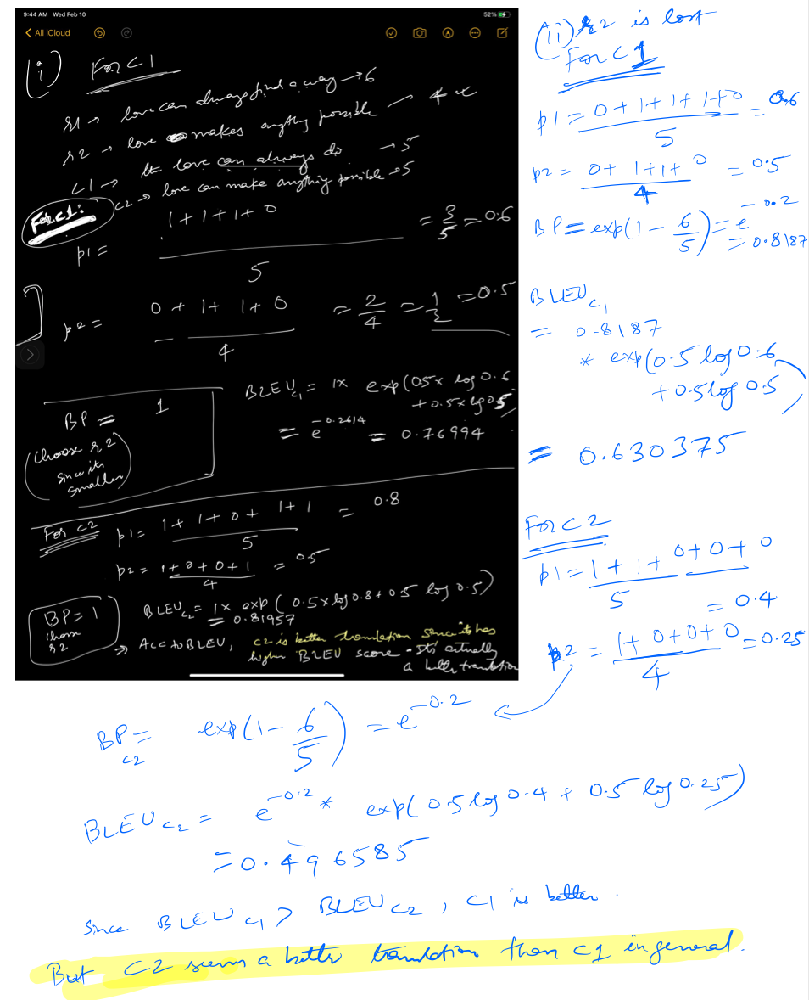

Q2. Analyzing NMT Systems (30 points)
1. Identify the error in the NMT translation.
2. Provide possible reason(s) why the model may have made the error (either due to a specific
linguistic construct or a specific model limitation).
3. Describe one possible way we might alter the NMT system to fix the observed error. There
are more than one possible fixes for an error. For example, it could be tweaking the size of the hidden layers or changing the attention mechanism.

i. (2 points) Source Sentence: Aqu ́ı otro de mis favoritos, “La noche estrellada”. 
Reference Translation: So another one of my favorites, “The Starry Night”. 
NMT Translation: Here’s another favorite of my favorites, “The Starry Night”.

Ans:
1. "So another" -> "Here's another"
2. ? 
3. ?

ii. (2 points) Source Sentence: Ustedes saben que lo que yo hago es escribir para los nin ̃os, y, de hecho, probablemente soy el autor para nin ̃os, ms ledo en los EEUU.
Reference Translation: You know, what I do is write for children, and I’m probably America’s most widely read children’s author, in fact.
NMT Translation: You know what I do is write for children, and in fact, I’m probably the author for children, more reading in the U.S.

Ans:
1. Error: "America’s most widely read children’s author" -> "the author for children, more reading in the U.S." 
2. Reason for error: 
  - " probablemente soy el autor para nin ̃os" means "I'm probably the author for kids"
  - "ms ledo en los EEUU." means "most read in the US"
  The NMT translated word by word without rearranging the words. 
3. Fix: Having a Bi-LSTM layer and/or more LSTM/RNN layers would probably help

iii. (2 points) Source Sentence: Un amigo me hizo eso – Richard Bolingbroke.
Reference Translation: A friend of mine did that – Richard Bolingbroke.
NMT Translation: A friend of mine did that – Richard <unk>

Ans:
1. Error: Bolingbroke -> <unk>
2. Reason: UNKs are not being replaced with original source language words which the model doesn't understand.
3. Fix: have a mapping maybe in the beginning to store the names before starting translation. Another one could be to add that name to the vocabulary. 
Lots of Answers in Lecture 9(60 min mark) for Winter 2019 lectures CS224N, strategies to deal with UNKs :
a. Train on a subset of vocabulary at a time.
b. Use attention to work out what you are translating: you can do something simple like dictionary lookup
c. Character models

iv. (2 points) Source Sentence: Solo tienes que dar vuelta a la manzana para verlo como una epifan ́ıa.
Reference Translation: You’ve just got to go around the block to see it as an epiphany. 
NMT Translation: You just have to go back to the apple to see it as an epiphany.

Ans:
Error: block -> apple
Reason: "la manzana" means "apple" as well as "city block"
Fix: The model is not able to guess the right meaning when a word can have multiple meanings. 
- Need to use attention to get the right context?
- Train on a well labeled dataset with idiom phrases(or with words with multiple meanings)

v. (2 points) Source Sentence: Ella salv ́o mi vida al permitirme entrar al ban ̃o de la sala de profesores.
Reference Translation: She saved my life by letting me go to the bathroom in the teachers’ lounge.
NMT Translation: She saved my life by letting me go to the bathroom in the women’s room.

Ans:
Error: teachers -> women
Reason: Model has probably only trained on dataset with lounges belonging to either men's or women's. 
Fix: Maybe train on more data?

vi. (2 points) Source Sentence: Eso es ma ́s de 100,000 hect ́areas. 
Reference Translation: That’s more than 250 thousand acres. 
NMT Translation: That’s over 100,000 acres.

Ans:
Error: missed 250 in translation.
Reason: 1 hectare = 2.471 acres; The model did not do the unit conversion from hectare to acres.
Fix: Teach conversion to models by training on appropriate data where conversions are present.

Q2(c): Blue score:

i.
Please consider this example:
Source Sentence s: el amor todo lo puede 
Reference Translation r1: love can always find a way 
Reference Translation r2: love makes anything possible 
NMT Translation c1: the love can always do
NMT Translation c2: love can make anything possible

Please compute the BLEU scores for c1 and c2. Let λi = 0.5 for i ∈ {1,2} and λi = 0 for i ∈ {3, 4} (this means we ignore 3-grams and 4-grams, i.e., don’t compute p3 or p4 ). When computing BLEU scores, show your working (i.e., show your computed values for p1, p2, len(c), len(r) and BP). Note that the BLEU scores can be expressed between 0 and 1 or between 0 and 100. The code is using the 0 to 100 scale while in this question we are using the 0 to 1 scale.

Which of the two NMT translations is considered the better translation according to the BLEU Score? Do you agree that it is the better translation

ii(5 points) Our hard drive was corrupted and we lost Reference Translation r2. Please recom- pute BLEU scores for c1 and c2, this time with respect to r1 only. Which of the two NMT translations now receives the higher BLEU score? Do you agree that it is the better translation? 
Ans:

iii(2 points) Due to data availability, NMT systems are often evaluated with respect to only a single reference translation. Please explain (in a few sentences) why this may be problematic. 
Ans: This can be problematic if the reference translation itself is not of good quality. Though we may have a high BLEU score, the candidate translation could still be bad. 

iv(2 points) List two advantages and two disadvantages of BLEU, compared to human evaluation, as an evaluation metric for Machine Translation.
Ans:
Advantages:
1. Quick and inexpensive to calculate
2. easy to understand
3. language independent
4. correlates highly with human evluation

Disadvantages:
1. Depedent on the quility of refernce(human)translation, whose quality decides the BLEU score
2. Doesn't consider meaning of sentence
3. doesn't directly consider sentence structure
4. doesn't map well to human judgements

